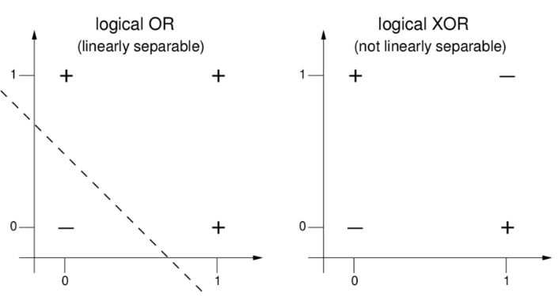

# Vídeo

https://github.com/FelipeCampos14/entregaveis-modulo8/assets/99193547/8e9ecfee-76f3-4e54-8248-b1311df64f0a

# Explicação

Os perceptrons são considerados classifcadores lineards, unicamente capazes de resolver problemas lineares. Isto é, quando há um limiar possível de ser determinado com apenas uma função. Porém em uma situação com a porta lógica xor, como visto abaixo, é necessária mais de uma função para resolver, não podendo ser resolvido com apenas um perceptron.

Esse problema cumulou no primeiro inverno da inteligência artificial, de 1974 até 1980, que apenas terminou pelo pivoteamento das pesquisas de IA para areas mais práticas e por avanços no poder computacional, que permitiu estas novas pesquisas.

